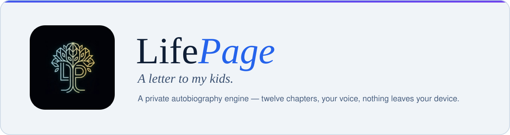
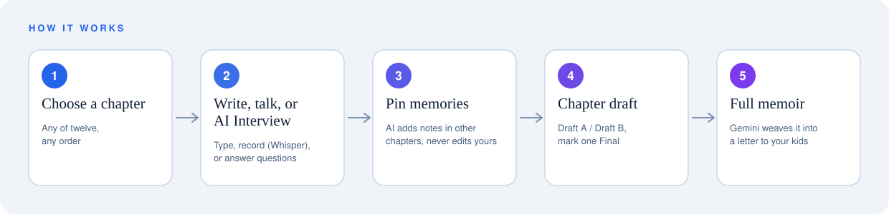
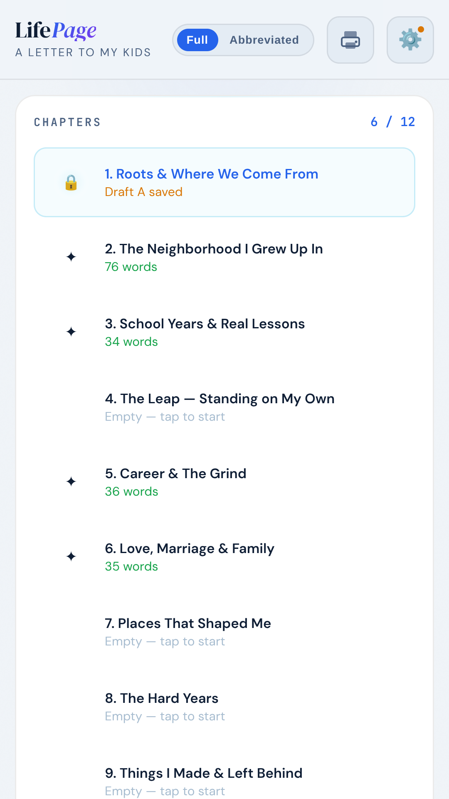
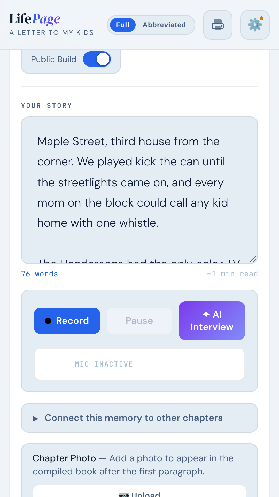
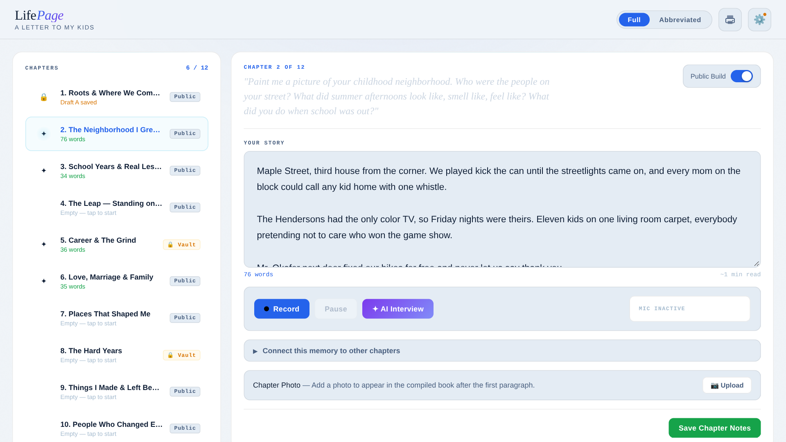
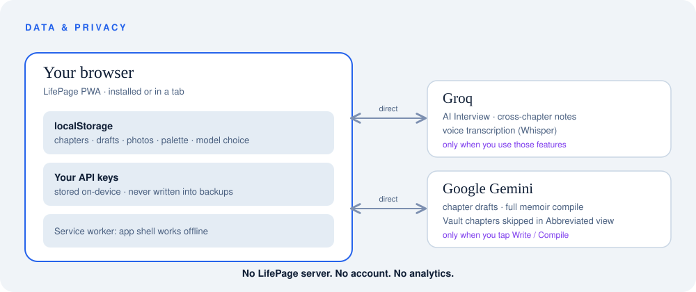

<div align="center">



[](https://johnlaz.github.io/lifepage/)
[](https://johnlaz.github.io/lifepage/app/)
[](https://lazlab.org)

*"No chapter needs to be complete. A few honest sentences is more than most people's children will ever have from them."*

</div>

---

## What it is

LifePage is a private, browser-based autobiography engine. You pick one of twelve chapters, write, talk, or answer an AI interviewer, and your book assembles itself, live, into a first-person memoir framed as a letter to your kids. Print it or share it as a web page.

No account. No subscription. No LifePage server. Your story lives in your browser, and AI features run on your own free API keys.

## Live URLs

| | |
|---|---|
| Landing page | https://johnlaz.github.io/lifepage/ |
| App (installable PWA) | https://johnlaz.github.io/lifepage/app/ |

## How it works



## Screenshots

<p align="center">
  
  &nbsp;
  
</p>
<p align="center"></p>

<sub>Screenshots use fictional sample text.</sub>

## Features

- **AI Interview** — a warm, guided conversation per chapter (Groq). Answers drop into the chapter with one tap.
- **Voice to Story** — record and transcribe with Groq Whisper, or use your keyboard's dictation.
- **Memory Connections** — pin other chapters; the AI adds a short note there when something belongs, without touching your words.
- **Draft A / Draft B** — two AI drafts per chapter (Gemini), each in a style you choose (*stay close to my words* or *polished*). Compare them, edit them by hand, and pick which one goes in the book. Replaced drafts and older notes are kept in History.
- **People & places** — tell the AI who you are, your children's names and who each person is, so names stay right in every interview and draft.
- **Book** — assembled locally from your chosen drafts (no AI rewrite step), with a cover, contents, chapter openers, pull quotes and page numbers. Print / Save as PDF, or download a shareable web page. Optional AI-drafted opening and closing letters you can edit.
- **Vault chapters** — mark a chapter Vault and it's left out of the book in Abbreviated view.
- **Full autobiography** — one tap weaves all chapters into a single memoir (Gemini).
- **Photos, palettes, backup/restore** — chapter photos, four color palettes (default: Slate), and separate Book and Photos JSON backups.

## The twelve chapters

| # | Chapter | # | Chapter |
|---|---------|---|---------|
| 1 | Roots & Where We Come From | 7 | Places That Shaped Me |
| 2 | The Neighborhood I Grew Up In | 8 | The Hard Years |
| 3 | School Years & Real Lessons | 9 | Things I Made & Left Behind |
| 4 | The Leap — Standing on My Own | 10 | People Who Changed Everything |
| 5 | Career & The Grind | 11 | If I Were Doing It Over |
| 6 | Love, Marriage & Family | 12 | What I Want You to Know |

## Repo layout

```
/
├── index.html          ← Landing page (plain webpage, no PWA)
├── README.md
├── docs/               ← README visuals (SVG only)
└── app/
    ├── index.html      ← The LifePage app (single file)
    ├── manifest.json   ← PWA manifest (scope /lifepage/app/)
    ├── sw.js           ← Service worker (scope /lifepage/app/)
    ├── icon-192.png
    ├── icon-512.png
    └── shot-narrow-1.png, shot-narrow-2.png, shot-wide.png   ← install-dialog + README screenshots
```

The manifest and service worker live in `/app/` on purpose, so the landing page stays a fast, plain webpage.

## AI & model setup

LifePage uses two free API keys, entered in **⚙️ Settings**. Both are optional until you use the feature that needs them.

| Provider | Used for | Get a key |
|----------|----------|-----------|
| Groq | AI Interview, memory-connection notes, voice transcription | [console.groq.com](https://console.groq.com) |
| Google Gemini | Chapter drafts and the full memoir | [aistudio.google.com](https://aistudio.google.com) |

**Model picker.** When you save a key, LifePage asks the provider which chat models that key can use and shows the newest few in a dropdown. **Refresh** re-pulls the list (it also refreshes quietly when it's more than 3 days old). Your selected model is never swapped automatically. If a model drops off the provider's list, it stays selected and is flagged so you can choose. Voice transcription is fixed to `whisper-large-v3`. The last-resort fallbacks before any key is saved are `llama-3.3-70b-versatile` (Groq) and `gemini-3.7-flash` (Gemini).

## Data & privacy



- Chapters, drafts, photos, and settings are stored in your browser's `localStorage`.
- AI calls go straight from your browser to Groq or Google with your own key. Text is sent only when you tap an AI action.
- Backups (Book + Photos JSON) **never include your API keys**.
- Clearing site data erases everything, so download backups regularly.
- No account, no login, no tracking.

## Install & offline

Open the app and use *Install* (Chrome/Android/desktop) or *Add to Home Screen* (iOS Safari). Once loaded, the app shell and fonts work offline; AI features need a connection. When a new version is available, the app shows an **Update** prompt instead of reloading underneath you. The current version is shown at the bottom of Settings.

## Deploy & update

Hosted on GitHub Pages from the `main` branch root. To release:

1. Edit `app/index.html` (and `index.html` if the landing changes).
2. Bump `VERSION` in `app/sw.js` **and** `APP_VERSION` in `app/index.html` (they must match; Settings shows both).
3. Commit and push. Installed apps will offer the Update prompt on next open.

## Changelog

**v1.3**
- App now registers its service worker and links its manifest (installable, offline shell).
- Update prompt, visible version stamp in Settings, and Google Fonts cached for offline.
- Model picker: saved model is never auto-swapped; missing models are kept and flagged.
- Flattened repo (two icons, no splash images), manifest trimmed to what the app supports.
- Accessibility pass (labels, dialog roles, keyboard-reachable controls, reduced motion).
- Landing: shared type pairing with the app, SVG feature icons, fixed logo link, phone-frame screenshots.
- Manifest now includes real install screenshots (2 narrow, 1 wide).

---

<div align="center">

**[→ Open LifePage](https://johnlaz.github.io/lifepage/app/)**

© 2026 LAZLAB Creations. All Rights Reserved. · [lazlab.io@gmail.com](mailto:lazlab.io@gmail.com)

</div>
